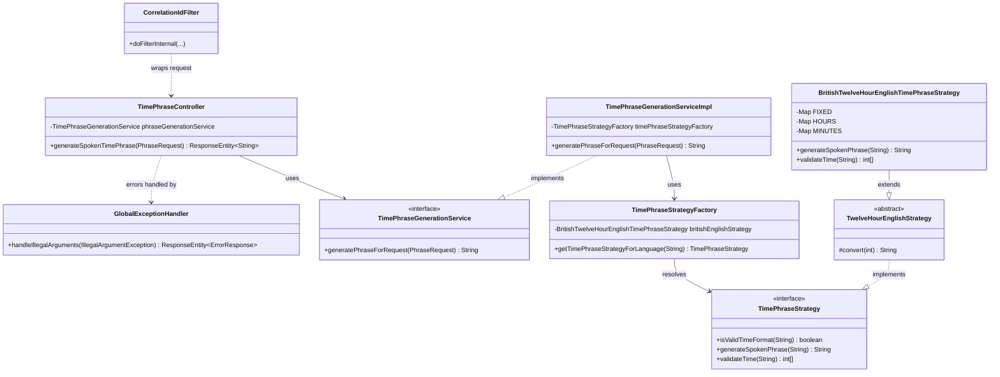

# Spoken Time Phrase

The goal is to generate the spoken phrase for a given time, in any supported language.

A Spring Boot REST API that converts a given time into its spoken-word phrase (e.g. `09:00` → *"nine o'clock"*).

Currently supports only **British English** (`BRITISH_ENGLISH`), 12-hour format, time input like `"09:00"`.

## Running the project

```bash
docker build -t spoken-time-phrase:1.0 .
docker compose up
```

The app will be available at **http://localhost:8080**.

## Calling the API

```bash
curl -X POST http://localhost:8080/api/v1/timephrase -H "Content-Type: application/json" -d '{"time":"09:00","language":"BRITISH_ENGLISH"}'
```

**Response:**
```
nine o'clock
```

## Design overview



**Flow:** a request hits `CorrelationIdFilter` first (tags it with a correlation ID for logging), then `TimePhraseController` → `TimePhraseGenerationServiceImpl` → `TimePhraseStrategyFactory` resolves the right `TimePhraseStrategy` implementation for the requested language → the strategy validates the time and generates the phrase. Any `IllegalArgumentException` thrown along the way is caught centrally by `GlobalExceptionHandler` and turned into a `400` response.